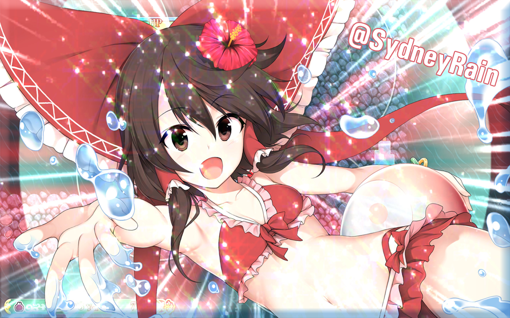

  </a>
  <h2 align="center">~ 💖 𝓗𝓮𝓵𝓵𝓸! 𝓦𝓮𝓵𝓬𝓸𝓶𝓮 𝓽𝓸 𝓶𝔂 𝓹𝓻𝓸𝓯𝓲𝓵𝓮 💖 ~</h1>
  
Hello and welcome! Name's Sydney. I'm yet another programmer whose trying to make random things that I find useful! Mostly, I work on Discord bots, but I also work on other projects sometimes. I mainly work in JavaScript, TypeScript, but I know a few other languages as well! 😁 I may not be the best at it, but I do try my hardest to make sure everything I make works and functions! I'm not on GitHub a lot but I'm on Discord quite often at <b>yukii#6035</b> so you could reach me there if you want to chat :)

  <h2 align="center">~ 💖 𝓐𝓫𝓸𝓾𝓽 𝓜𝓮 💖 ~</h1>
  <li>
  <b>Name:</b> Sydney M</li>
  <li>
  <b>Age:</b> 21
  </li>
  <li>
  <b>Gender:</b> Female
  </li>
  <li>
  <b>Interests:</b> Programming, Graphical Design, Astrology, Drawing, Fashion & Cooking :)
  </li>
  <li>
  <b>Projects:</b> <a href="https://github.com/SydneyRain/nibiru">Nibiru Discord Bot</a>, <a href="https://github.com/SydneyRain/insult">Insulter</a>
  </li>
  <h2 align="center">~ 💖 𝓢𝓽𝓪𝓽𝓼 💖 ~</h1>
  

  

<!--
**SydneyRain/SydneyRain** is a ✨ _special_ ✨ repository because its `README.md` (this file) appears on your GitHub profile.

Here are some ideas to get you started:

- 🔭 I’m currently working on ...
- 🌱 I’m currently learning ...
- 👯 I’m looking to collaborate on ...
- 🤔 I’m looking for help with ...
- 💬 Ask me about ...
- 📫 How to reach me: ...
- 😄 Pronouns: ...
- ⚡ Fun fact: ...
-->
